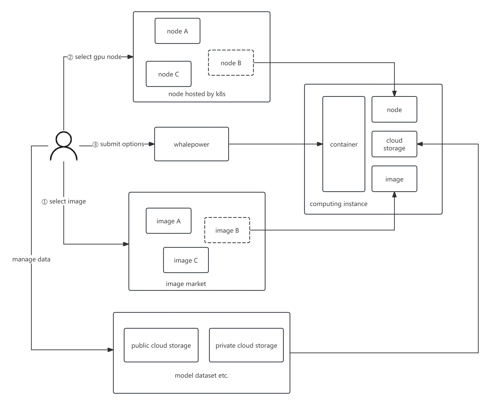

# whalepower

解决有很多算力卡的主机的场景，用户可以选择某个算力卡，快速部署自己的镜像，在容器里面coding，项目永久开源免费，欢迎issue。

> Whalepower，有鲸鱼力量的含义，寓意“大而强大、充满能量的计算平台”。

## 功能点

- [ ] 算力节点查看
- [ ] 算力实例创建
    - [ ] 系统盘（镜像本身）
    - [ ] 数据盘（节点上的分区）
    - [ ] 网盘（管理个人数据）
- [ ] 算力镜像管理
- [ ] 存储网盘管理
    - [ ] minio对象存储

## 软件架构

算力平台v1alpha1
